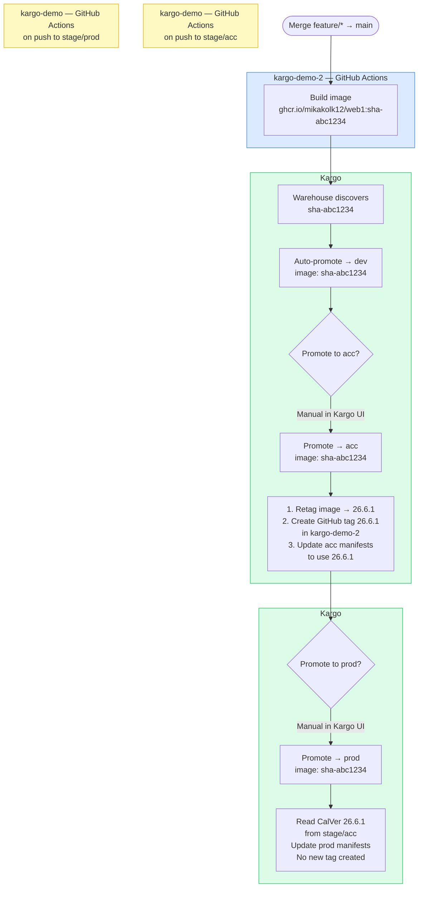
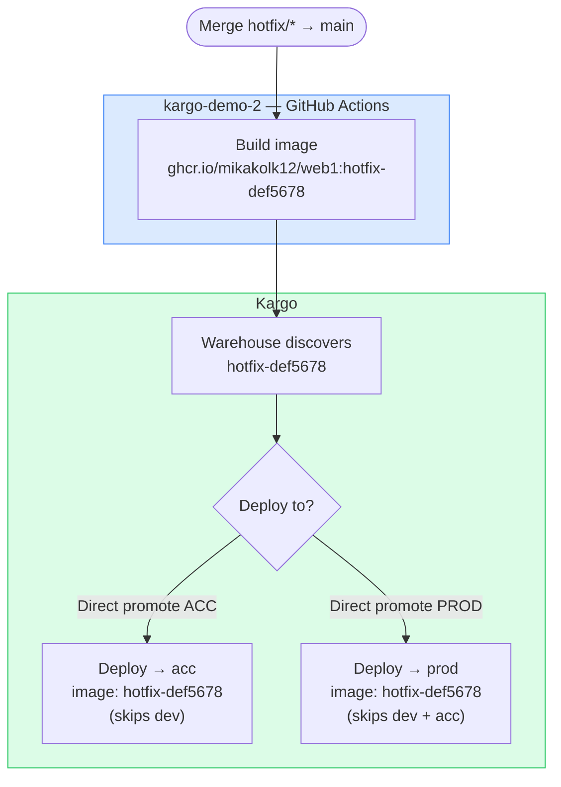

# GitOps Promotion Flows

## Flow 1 — Feature

## Flow 2 — Hotfix

## Tag naming

| Flow    | CI tag             | After acc promotion | After prod promotion |
|---------|--------------------|---------------------|----------------------|
| Feature | `sha-abc1234`      | `26.6.1`            | `26.6.1` (same)      |
| Hotfix  | `hotfix-def5678`   | `hotfix-def5678`    | `hotfix-def5678`     |

## Secrets required in kargo-demo repo

| Secret        | Purpose                                              |
|---------------|------------------------------------------------------|
| `CALVER_PAT`  | GitHub PAT (repo scope) to create tags in kargo-demo-2 and read/push images to GHCR |
